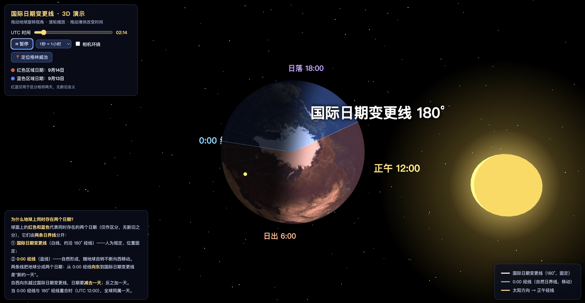

# 国际日期变更线 · 3D 教学演示 | International Date Line 3D Demo



**在线演示 | Live Demo：https://jackjimmy.github.io/international-date-line-3d/**

一个浏览器直接打开的 3D 交互式教学页面，用太空中的地球直观演示**国际日期变更线**的工作原理：为什么地球上同时存在两个日期、新的一天如何诞生并扫过全球。纯静态页面、完全离线可用，双击 `index.html` 即可运行，也可直接部署到 GitHub Pages。

An interactive 3D teaching demo that visualizes the **International Date Line** on a rotating Earth in space: why two dates exist on Earth at once, and how a new day is born and sweeps across the globe. Pure static page, works fully offline — just open `index.html`, or deploy to GitHub Pages.

## 功能特性 | Features

- **中英双语**：根据浏览器语言自动选择（中文浏览器→中文，其余→English），左上角按钮可随时手动切换
- **太空场景**：星空、太阳光照；晨昏线严格由地日几何关系决定，与视角无关
- **真实地球自转**：大陆海洋贴图与经纬网（每 15° = 一个时区）一起旋转，速度可调（1秒 = 15分钟 / 1小时 / 4小时）
- **红蓝日期分区**：按日期奇偶交替染色，连续变化无突变，仅区分相邻两天
- **两条日界线**：白线 = 国际日期变更线（180°，随地球转）；蓝线 = 0:00 经线（空间中固定，地球从下面转过）
- **定位格林威治**：相机锁定格林威治天文台上空跟随自转，实时显示当地时间（0° 经线的地方时即 UTC）
- **自由交互**：拖动旋转、滚轮缩放、UTC 时间滑块（可跨天连续拖动）、相机环绕

- **Bilingual UI (中文 / English)**: auto-detected from browser language (Chinese → 中文, otherwise → English), with a manual toggle button in the top-left panel
- **Space scene**: stars and sunlight; the terminator is computed from the real Earth–Sun geometry, independent of the camera
- **True Earth rotation**: continents, oceans and the graticule (every 15° = one time zone) rotate together; speed adjustable (1s = 15min / 1hr / 4hr)
- **Red/blue date zones**: colored by date parity, changing continuously with no abrupt flips; colors only distinguish the two adjacent dates
- **Two date boundaries**: white = International Date Line (~180°, glued to the globe); blue = 0:00 meridian (fixed in space while Earth rotates beneath it)
- **Locate Greenwich**: camera locks onto Greenwich Observatory (0°, 51.5°N) and follows the rotation, showing its live local time — local time at 0° is UTC by definition
- **Free interaction**: drag to rotate, scroll to zoom, UTC time slider (draggable across days), orbiting camera

## 快速开始 | Quick Start

```bash
open index.html        # macOS，直接打开
start index.html       # Windows
python3 -m http.server 8000   # 或者起个本地服务器
```

## 课堂演示建议 | Teaching Tips

1. 开「1秒 = 4小时」档：看新的一天如何从日界线"诞生"并扫过全球
2. 拖到 UTC 12:00：两条日界线重合，全球同属一天
3. 定位格林威治 + 自转演示：盯着一个地点经历日出→正午→日落→子夜，日期在 0:00 经线扫过时翻篇

1. Run at "1s = 4hr": watch a new day born at the Date Line and sweep across the globe
2. Slide to UTC 12:00: the two boundaries coincide — the whole world shares one date
3. Locate Greenwich + rotate: follow one location through sunrise → noon → sunset → midnight, and watch its date flip as the 0:00 meridian passes

## 技术说明 | Tech Notes

- [Three.js r128](https://github.com/mrdoob/three.js/) (MIT) + OrbitControls，本地引用无 CDN 依赖；地球贴图内嵌为 base64，绕过 `file://` 的 CORS 限制
- 自定义着色器：世界空间法线 × 太阳方向 → 昼夜；`floor(UTC天数 + 经度/360)` → 本地日期，按奇偶交替染色（天然包含两条日界线规则）
- 内部时间连续累计（可跨天），颜色与自转无跳变

- [Three.js r128](https://github.com/mrdoob/three.js/) (MIT) + OrbitControls, served locally with no CDN dependency; the Earth texture is embedded as base64 to bypass `file://` CORS restrictions
- Custom shader: world-space normal × sun direction for day/night; `floor(UTC days + longitude/360)` gives each point's local date, colored by parity (this single formula encodes both date boundaries)
- Time is tracked as continuous minutes (across days), so colors and rotation never jump

项目结构：`index.html`（页面与全部逻辑）、`lib/`（Three.js 库）、`textures/`（贴图）、`screenshot.jpg`（本文档截图）
